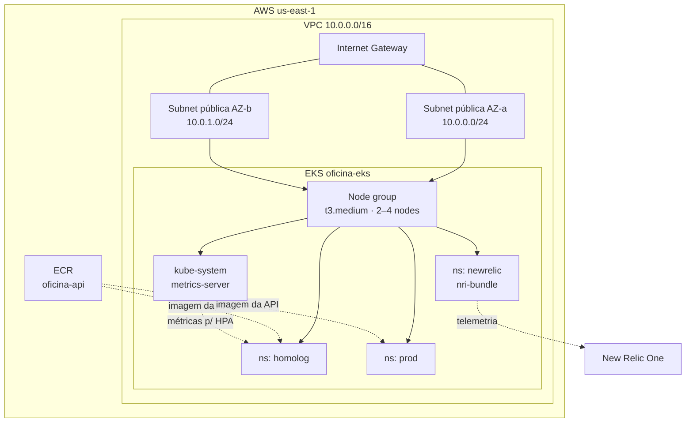
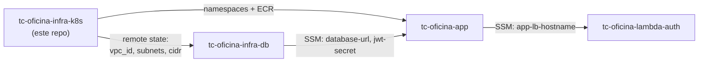

# tc-oficina-infra-k8s

Infraestrutura como código do cluster Kubernetes que hospeda o sistema da oficina mecânica — Tech Challenge FIAP SOAT, Fase 3, grupo **Integradores**.

## Propósito

Este repositório provisiona, com um único `terraform apply`, toda a base de computação da solução: a VPC e suas subnets, o cluster **EKS** com node group escalável, o repositório **ECR** onde a imagem da API é publicada, os namespaces `homolog` e `prod` que separam os dois ambientes e os addons que o cluster precisa para nascer utilizável (**metrics-server**, requisito do HPA, e o **bundle New Relic**, que alimenta os dashboards de observabilidade).

É o **primeiro** repositório de infraestrutura a ser aplicado. O `tc-oficina-infra-db` lê o remote state gerado aqui para descobrir em qual VPC e subnets criar o RDS, e o CD do `tc-oficina-app` faz deploy dentro dos namespaces criados aqui. Nada mais no ecossistema lê o state deste repositório diretamente — o contrato é a tabela de outputs abaixo.

A separação em um repositório próprio atende à exigência do enunciado de manter o cluster gerenciado por IaC em repositório dedicado, com CI e CD independentes do ciclo de vida da aplicação: o cluster muda raramente, a aplicação muda a cada PR.

## Tecnologias

| Item | Versão |
| --- | --- |
| Terraform | ≥ 1.11.0 (CI fixa 1.15.9) |
| Provider `hashicorp/aws` | ~> 5.0 |
| Provider `hashicorp/kubernetes` | ~> 2.33 |
| Provider `hashicorp/helm` | ~> 2.16 |
| Kubernetes (EKS) | versão padrão do EKS na criação |
| Chart `metrics-server` | 3.12.2 |
| Chart `nri-bundle` (New Relic) | flutuante (recomendação da New Relic) |
| CI/CD | GitHub Actions |

## Arquitetura deste repositório



Ordem de aplicação entre os repositórios da fase:



## Outputs expostos via remote state

State remoto: bucket `tc-fiap-oficina-tfstate-076155200589`, key `fase-3/infra-k8s.tfstate`, região `us-east-1`.

| Output | Tipo | Consumido por |
| --- | --- | --- |
| `vpc_id` | `string` | `tc-oficina-infra-db` (security group do RDS) |
| `public_subnet_ids` | `list(string)` | `tc-oficina-infra-db` (DB subnet group) |
| `vpc_cidr_block` | `string` | `tc-oficina-infra-db` (regra de ingress dos pods) |
| `cluster_name` | `string` | referência/documentação (`oficina-eks`) |
| `ecr_repository_url` | `string` | CD do `tc-oficina-app` (push da imagem) |
| `cluster_endpoint` | `string` | diagnóstico |
| `configure_kubectl` | `string` | comando pronto de `update-kubeconfig` |

**Renomear qualquer um dos três primeiros quebra o `tc-oficina-infra-db`.** Mudanças nesse contrato exigem PR nos dois repositórios.

Consumo a partir de outro repositório:

```hcl
data "terraform_remote_state" "k8s" {
  backend = "s3"
  config = {
    bucket = "tc-fiap-oficina-tfstate-076155200589"
    key    = "fase-3/infra-k8s.tfstate"
    region = "us-east-1"
  }
}
```

## Como executar localmente

Pré-requisitos:

- Terraform ≥ 1.9, AWS CLI v2 e `kubectl` instalados (o AWS CLI é usado pelos providers `kubernetes`/`helm` para obter o token do cluster via `aws eks get-token`).
- Sessão do **AWS Academy Learner Lab ativa**, com as credenciais exportadas no ambiente. No repositório `tc-oficina-app` existe `scripts/aws-academy-refresh.ps1`, que atualiza as credenciais locais e propaga os secrets para os 4 repositórios.
- Bucket de state `tc-fiap-oficina-tfstate-076155200589` já existente (criado na Fase 2).

```bash
cp terraform.tfvars.example terraform.tfvars   # opcional: sobrescrever defaults
export TF_VAR_new_relic_license_key="<license key>"   # opcional, ver abaixo

terraform init
terraform plan
terraform apply
```

Depois do apply:

```bash
aws eks update-kubeconfig --region us-east-1 --name oficina-eks
kubectl get ns                  # homolog, prod e newrelic presentes
kubectl top nodes               # metrics-server respondendo (HPA viável)
kubectl get pods -n newrelic    # agentes Running
```

### Aplicando antes de existir conta New Relic

`new_relic_license_key` tem default `""`. Vazio, o `helm_release.newrelic` simplesmente não é criado — dá para subir o cluster inteiro agora e instalar a telemetria depois, bastando definir o secret e reaplicar. Não é preciso comentar código.

### Se o primeiro `apply` reclamar de configuração de provider desconhecida

Os providers `kubernetes` e `helm` são configurados a partir de atributos do `aws_eks_cluster.main`, que ainda não existe no primeiro apply. Terraform normalmente resolve isso sozinho, mas se ele recusar o plano, aplique em duas etapas — uma única vez, na criação do cluster:

```bash
terraform apply -target=aws_eks_node_group.main
terraform apply
```

Applies seguintes (cluster já no state) funcionam em uma etapa só.

## Deploy

| Gatilho | Workflow | O que faz |
| --- | --- | --- |
| PR para `main` ou `develop` | `.github/workflows/ci.yml` | `terraform fmt -check`, `init -backend=false`, `validate` e um `plan` best-effort |
| Merge de PR em `main` | `.github/workflows/cd.yml` | `terraform init` + `terraform apply -auto-approve` |
| Manual | ambos (`workflow_dispatch`) | mesma coisa, sob demanda |

O `plan` do CI é best-effort de propósito: as credenciais do Learner Lab expiram em ~4h e falhariam a pipeline por um motivo que não é do código. `fmt` e `validate` permanecem obrigatórios e não dependem de AWS.

Diferente do app, aqui não há deploy por ambiente: a infraestrutura é **única** e serve `homolog` e `prod` ao mesmo tempo. Por isso o CD roda apenas no merge em `main`, com `concurrency: cd-infra-k8s` impedindo dois applies simultâneos sobre o mesmo state.

Secrets necessários no repositório:

| Secret | Origem | Obrigatório |
| --- | --- | --- |
| `AWS_ACCESS_KEY_ID` | Learner Lab (rotativo) | sim |
| `AWS_SECRET_ACCESS_KEY` | Learner Lab (rotativo) | sim |
| `AWS_SESSION_TOKEN` | Learner Lab (rotativo) | sim |
| `NEW_RELIC_LICENSE_KEY` | conta New Relic do grupo | não (vazio pula o bundle) |

Deploy manual de contingência: rodar `terraform init && terraform apply` localmente com o lab ativo, exatamente como na seção anterior — o state é o mesmo do CI, então não há divergência.

## Trade-offs desta arquitetura (conta AWS Academy)

| Decisão | Motivo | Como seria em produção |
| --- | --- | --- |
| Nodes em **subnets públicas** com IP público | o Learner Lab não comporta o custo de NAT Gateway | subnets privadas + NAT Gateway, apenas o LoadBalancer exposto |
| **`LabRole`** como role do cluster e dos nodes | a conta Academy não permite criar IAM roles | roles dedicadas por função, com permissão mínima |
| **Um cluster, dois namespaces** para homolog e prod | limite de recursos e custo do lab | clusters separados, idealmente em contas AWS distintas |
| Estado remoto em S3 com `use_lockfile` | sem tabela DynamoDB (locking nativo do S3, exige Terraform ≥ 1.10) | S3 + locking nativo é hoje a recomendação da HashiCorp |
| Chart `nri-bundle` sem versão fixa | recomendação da New Relic para o bundle | pinar versão e promover por ambiente |

## Links

- Repositórios da solução:
  - [`tc-oficina-app`](https://github.com/FIAP-POS-TECH-SOFTWARE-ARCHITECTURE/tc-oficina-app) — aplicação NestJS
  - [`tc-oficina-lambda-auth`](https://github.com/FIAP-POS-TECH-SOFTWARE-ARCHITECTURE/tc-oficina-lambda-auth) — autenticação de cliente por CPF
  - [`tc-oficina-infra-k8s`](https://github.com/FIAP-POS-TECH-SOFTWARE-ARCHITECTURE/tc-oficina-infra-k8s) — este repositório
  - [`tc-oficina-infra-db`](https://github.com/FIAP-POS-TECH-SOFTWARE-ARCHITECTURE/tc-oficina-infra-db) — banco gerenciado
- Documentação arquitetural: `docs/arquitetura/` no `tc-oficina-app`
- Deploy ativo: o cluster roda em conta AWS Academy e fica disponível sob demanda (lab ligado)

## Grupo Integradores

| Nome | RM |
| --- | --- |
| Lucas Gardini Dias | 372237 |
| Thiago Aio | 372238 |
